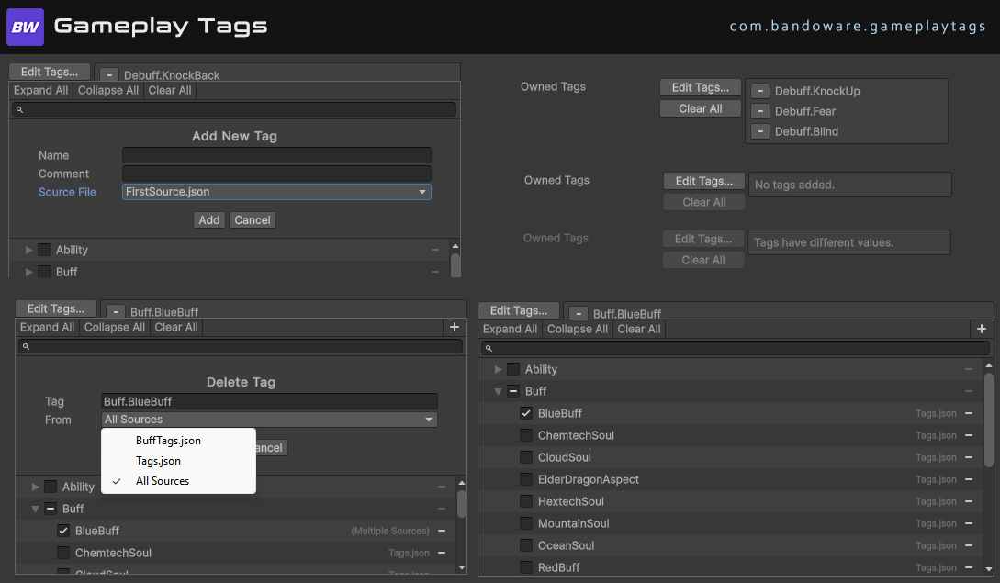

<div align="center">
    
</div>

# Gameplay Tags for Unity

---

## Overview

This package brings to Unity the concept of **Gameplay Tags**, inspired by Unreal Engine’s Gameplay Tag system.

Gameplay Tags are **string-based identifiers** organized in a hierarchical way. They provide a flexible and efficient way to describe, categorize, and query gameplay-related states and properties.

They are useful for:

* Marking abilities, states, effects, or interactions.
* Checking conditions without hard-coded references.
* Creating clean and scalable gameplay logic.

With this package, you can register, organize, and use tags directly in Unity projects with an API designed to feel natural in C#.

---

## Getting Started

Before you can use tags, you first need to **create them**.
There are three main ways to register tags in your project:

### 1. JSON Files in Project Settings

Create a folder named `ProjectSettings/GameplayTags`.
Every `.json` file inside this folder will be automatically scanned and its tags registered.

The format is a JSON object where **each property is a tag**.
The value of that property is another object, which may optionally include metadata such as a developer-facing comment:

```json
{
  "Damage.Fatal": {},
  "Damage.Miss": {
    "Comment": "Attack landed but did not cause damage"
  },
  "CrowdControl.Stunned": {
    "Comment": "Unit cannot act at all"
  }
}
```

👉 You can have multiple JSON files in this folder — there’s no limitation to just one.

---

### 2. Creating Tags via the Editor

Tags can also be created directly in the **Unity Editor**.
The editor will generate the corresponding JSON file automatically and insert the tag for you *(creating the file if necessary)*.

<div align="center">
    
    <p><em>[Placeholder — here goes the screenshot showing where to add tags in the Editor]</em></p>
</div>

---

### 3. Registering Tags with Assembly Attributes

The third option is to declare tags directly in your assembly using attributes:

```csharp
[assembly: GameplayTag("Damage.Fatal")]
[assembly: GameplayTag("Damage.Miss")]
[assembly: GameplayTag("CrowdControl.Stunned")]
```

This approach is particularly useful when your **code requires the existence of certain tags**.
It ensures that the tag is always registered alongside the code that depends on it.

---

## API

### `GameplayTag`

A lightweight struct representing a gameplay tag.
Strings are implicitly convertible to `GameplayTag`, so you can write `"Damage.Fire"` directly where a `GameplayTag` is expected.

#### Core Properties

* **`string Name`** → The full name of the tag (e.g., `"Damage.Fire"`).
* **`bool IsValid`** → Whether the tag is valid (registered in the system).
* **`bool IsNone`** → Whether the tag is the special `None` tag.
* **`bool IsLeaf`** → Whether the tag has no children.
* **`GameplayTag None`** → A special value representing an empty or invalid tag.

#### Hierarchy Properties

* **`ParentTags`** → All parent tags of this tag, ordered from root to immediate parent.

  * Example: for `"A.B.C"`, the parent tags are `["A", "A.B"]`.

* **`ChildTags`** → All direct child tags of this tag.

  * Example: if `"A.B.C"` has two children `"A.B.C.D"` and `"A.B.C.E"`, they will appear here.

* **`HierarchyTags`** → The full hierarchy chain including this tag and all of its parents.

  * Example: for `"A.B.C"`, the hierarchy tags are `["A", "A.B", "A.B.C"]`.

---

### `GameplayTagManager`

A static class responsible for managing all registered tags in the project.

* **`RequestTag(string name, bool logWarningIfNotFound = true)`** → Gets a `GameplayTag` by name (returns `GameplayTag.None` if not found).
* **`GetAllTags()`** → Returns all registered tags.
* **`HasBeenReloaded`** *(property)* → Indicates whether the tags have been reloaded at runtime.

---

### `GameplayTagContainer`

The main API for working with sets of tags.
Provides methods to add, remove, query, and combine gameplay tags.

#### Managing Tags

* **`AddTag(tag)`** → Adds a tag to the container.
* **`RemoveTag(tag)`** → Removes a tag from the container.
* **`Clear()`** → Clears all tags.

#### Querying Tags

* **`HasTag(tag)`** → Checks if the container contains the given tag (directly or via hierarchy).
* **`HasAny(container)`** → Returns `true` if any tag from another container are present.
* **`HasAll(container)`** → Returns `true` if all tags from another container are present.
* **`HasAnyExact(container)`** → Like `HasAny`, but only matches tags explicitly added.
* **`HasAllExact(container)`** → Like `HasAll`, but only matches tags explicitly added.

#### Combining Containers

* **`Union(containerA, containerB)`** → Creates a new container with all unique tags from both.
* **`Intersection(containerA, containerB)`** → Creates a new container with only the tags present in both.

---

### `GameplayTagCountContainer`

A variation of `GameplayTagContainer` that also tracks how many times each tag has been added, with support for callbacks when counts change.

Additional API:

* **`GetTagCount(tag)`** → Returns the current count of the given tag.
* **`RegisterTagEventCallback(tag, GameplayTagEventType type, Action<GameplayTag,int> callback)`** → Registers a callback triggered when the tag count changes.
* **`RemoveTagEventCallback(tag, GameplayTagEventType type, Action<GameplayTag,int> callback)`** → Removes a previously registered callback.

---

## License

This project is licensed under the Creative Commons Attribution 4.0 International (CC BY 4.0) License. See the [LICENSE](LICENSE.md) file for details.